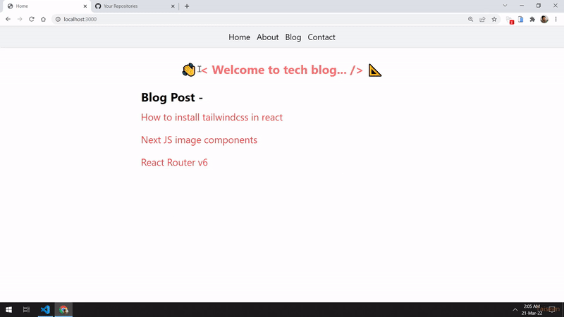

18 March 2022 

# Next Js + Tailwind CSS | App 

### installed process

* yarn create next-app [yourProjectName]
* yarn add -D tailwindcss postcss autoprefixer

* npx tailwindcss init -p

```
content: [
    "./pages/**/*.{js,ts,jsx,tsx}",
    "./components/**/*.{js,ts,jsx,tsx}",
],
```

## Getting Started

First, run the development server:

```bash
npm run dev
# or
yarn dev
```

```
<a href=" " target="_blank" rel="noopener noreferrer">

    <Image src="" alt="" width={72} height={16} />

</a>
```

```
"scripts": {
    ...
    "export": "next build && next export"
},
```

* yarn export

`trailingSlash: true,` ==> in `next.config.js` file for `SSG` link working + reload/refresh working properly.

<br/>

<video src="./demo.mp4" controls style="width: 100%; height: 100%; " />

# [Demo video](https://vimeo.com/690287431)

<br/>


